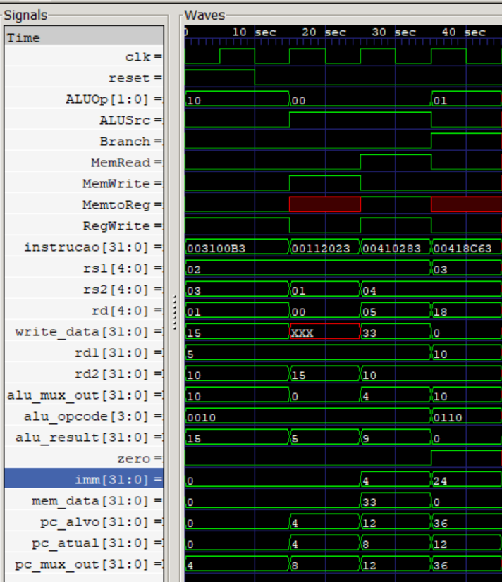

# RISC-V de Ciclo Único em Verilog

Este projeto implementa um processador RISC-V de ciclo único utilizando a linguagem de descrição de hardware Verilog. O desenvolvimento faz parte do projeto final da disciplina **Arquitetura de Computadores** da Universidade Católica de Santos.

### 👨‍🏫 Professor
**Walter S. Oliveira**  
[walter.oliveira@unisantos.com](mailto:walter.oliveira@unisantos.com)

---

### 🧠 Objetivo

Desenvolver um processador funcional que execute um conjunto de instruções RISC-V, com suporte para:

- Instruções de **load** e **store**: `lw`, `sw`
- Instruções aritméticas: `add`, `sub`, `and`, `or`
- Instrução de desvio condicional: `beq`

---

### 📦 Estrutura do Projeto

O processador foi modularizado em componentes individuais. Abaixo está a descrição de cada módulo:

#### 1. **Unidade Lógica e Aritmética (ULA)**
- Realiza operações lógicas e aritméticas de acordo com o sinal de controle.
- Sinais:
  - Entrada: `a`, `b`, `alu_opcode`
  - Saída: `alu_result`, `zero`

#### 2. **Unidade de Controle**
- Gera os sinais de controle com base no opcode da instrução.
- Sinais de saída: `RegWrite`, `MemWrite`, `MemRead`, `ALUSrc`, `Branch`, `MemtoReg`, `ALUOp`

- De acordo com o sinal de controle, certos estagios serãos feitos para determinadas instruções.

#### 3. **Banco de Registradores**
- 32 registradores de 32 bits
- Sinais:
  - Entrada: `rs1`, `rs2`, `rd`, `write_data`, `RegWrite`
  - Saída: `rd1`, `rd2`

#### 4. **Memórias**

*Memória de instruções*

- Responsável por fornecer a instrução correspondente ao endereço do Program Counter (PC).

- Contém 256 posições, cada uma com 32 bits.

As instruções são carregadas a partir de um arquivo externo (instructions.txt) na simulação, com o comando:

`$readmemh("instructions.txt", mem, 0, 3);`

*Memoria de dados*

- Utilizada para operações de leitura (lw) e escrita (sw) realizadas durante a execução do programa.

- Possui 65 posições de 32 bits, endereçadas por um valor de 32 bits vindo da ULA.

#### 5. **Gerador de Imediato**
O **Gerador de Imediato (imm_gen)** é responsável por extrair e estender corretamente os valores imediatos a partir do campo da instrução, de acordo com seu formato RISC-V (I, S ou B). A extensão é **sinalizada** (sign extension), garantindo que o valor preserve seu sinal original.

##### 🧩 Suporte aos formatos:

- **Tipo I** (`lw`):
  - Campo: `inst[31:20]`
  - Imediato: `{{20{inst[31]}}, inst[31:20]}`  
  - Comentário: extensão do bit de sinal para formar um inteiro de 32 bits.

- **Tipo S** (`sw`):
  - Campo: `inst[31:25]`, `inst[11:7]`
  - Imediato: `{{20{inst[31]}}, inst[31:25], inst[11:7]}`
  - Comentário: os bits do imediato são divididos na instrução; este módulo os concatena e estende corretamente.

- **Tipo B** (`beq`):
  - Campo: `inst[31]`, `inst[7]`, `inst[30:25]`, `inst[11:8]`
  - Imediato: `{{20{inst[31]}}, inst[7], inst[30:25], inst[11:8], 1'b0}`
  - Comentário: o valor imediato é deslocado à esquerda (por isso o `1'b0` final), formando um offset para desvio de instruções condicionais.

#### 6. **Multiplexadores**
- Utilizados para selecionar entre:
  - Registrador ou imediato (ALUSrc)
  - Resultado da ALU ou dado da memória (MemtoReg)
  - PC+4 ou endereço de desvio (PCSrc)

#### 7. **Somadores**
- Um somador para PC+4 e outro para calcular endereços de desvio (`PC + imm`)

#### 8. **Datapath Completo**
- Integra todos os módulos conforme o diagrama de arquitetura de ciclo único do RISC-V.

---

### 🧪 Simulação (GTKWave)

A simulação foi realizada no GTKWave utilizando um testbench que executa quatro instruções específicas. A imagem abaixo representa a execução dessas instruções no processador implementado:

📌 **Instruções Testadas e Resultados:**

1. **`add x1, x2, x3`**  
   - `instrucao = 0x003100B3`  
   - Soma os valores de `x2 = 5` e `x3 = 10` → resultado `15` armazenado em `x1`.  
   - Verificou-se corretamente a operação da ULA (`alu_result = 15`) e escrita no registrador (`write_data = 15`).

2. **`sw x1, 0(x2)`**  
   - `instrucao = 0x00112023`  
   - Armazena `x1 = 15` no endereço apontado por `x2 = 10`.  
   - `MemWrite = 1` e `mem_data = 15` confirmam a operação de escrita na memória.

3. **`lw x5, 0(x2)`**  
   - `instrucao = 0x00410283`  
   - Carrega para `x5` o valor armazenado no endereço apontado por `x2 = 10`.  
   - `MemRead = 1`, `mem_data = 33`, e `write_data = 33` indicam que o valor foi lido e gravado corretamente.

4. **`beq x3, x4, 12`**  
   - `instrucao = 0x00418C63`  
   - Compara `x3 = 10` com `x4 = 10`, e como são iguais (`zero = 1`), o salto de 12 bytes é realizado.  
   - `pc_alvo = 36`, `pc_mux_out = 36`, e `pc_atual = 36` confirmam o funcionamento do desvio condicional.

✅ Todas as instruções foram validadas com sucesso, com sinais de controle e dados fluindo corretamente pelos módulos do processador.

### 🛠️ Ferramentas Utilizadas

- **Verilog**: linguagem de descrição de hardware
- **Icarus Verilog**: compilação e simulação
- **GTKWave**: visualização de ondas
- **VS Code**: desenvolvimento

---

### ✅ Status dos Módulos

| Módulo               | Status      
|----------------------|-------------
| PC e PC+4            | ✅ Pronto   
| Instruction Memory   | ✅ Pronto 
| Unidade de Controle  | ✅ Pronto 
| ALU e ALU Control    | ✅ Pronto 
| Registradores        | ✅ Pronto 
| Immediate Generator  | ✅ Pronto 
| MUXes                | ✅ Pronto 
| Data Memory          | ✅ Pronto 
| Somadores            | ✅ Pronto 
| Testbench            | ✅ Pronto 

---

### 📌 Conclusão

Este projeto demonstrou com sucesso o funcionamento de um processador RISC-V de ciclo único, capaz de executar um pequeno conjunto de instruções com controle e fluxo de dados corretos, validado por simulações no GTKWave.
